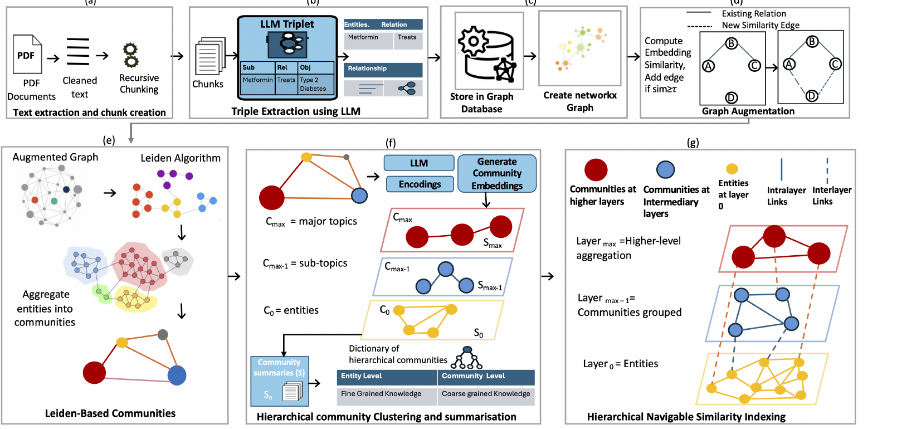

# HAGRAG

**Hierarchical Attributed Graph Communities based Retrieval-Augmented Generation**

Official research implementation accompanying the paper:

> **A Hierarchical Attributed Graph RAG Framework for Biomedical Literature Retrieval**  
> Maneeha Rani, Bhupesh Kumar Mishra, Dhavalkumar Thakker, and Javed Ali Khan  
> Accepted in *Machine Learning: Science and Technology* (IOP Publishing), 2026.

HAGRAG builds a knowledge graph from biomedical literature, augments the graph with semantic
connections, constructs multi-level communities, indexes entities and community summaries in a
C-HNSW hierarchy, and performs layer-aware retrieval before evidence-constrained answer generation.

This repository is organized as an installable Python project. The original development notebook is
not required to build, query, or evaluate HAGRAG.



## Method overview

The implementation follows the paper workflow:

1. **Document processing** — extract text from the selected PubMed PDFs and create separator-aware
   chunks of 1,024 characters with an overlap of 20 characters.
2. **Knowledge graph construction** — use Llama 3.1 8B to extract attributed biomedical entities and
   relationships and store them in Neo4j.
3. **Graph augmentation** — encode entities with `all-MiniLM-L6-v2` and add semantic links to the
   five nearest neighbours above the configured similarity threshold.
4. **Hierarchical community construction** — construct and summarize communities recursively using
   Leiden, Louvain, or Agglomerative clustering.
5. **C-HNSW indexing** — index entity and community embeddings with intra-layer similarity links and
   nearest-neighbour inter-layer links.
6. **Layer-aware retrieval** — traverse from coarse to fine layers, score retrieved information for
   relevance, apply a layer-weighting strategy, and retain the strongest evidence.
7. **Response generation** — generate the final answer from the retrieved graph evidence only.

The four weighting strategies evaluated in the paper are available as `abstract`, `equal`,
`specific`, and `adaptive`.

## Repository structure

```text
HAGRAG/
├── assets/
│   └── hagrag_overview.png
├── configs/
│   └── paper.yaml              # paper experiment configuration
├── data/
│   └── README.md               # expected corpus and QA layout
├── examples/
│   └── quickstart.py
├── scripts/
│   └── reproduce_paper.py      # clustering × weighting experiment runner
├── src/hagrag/
│   ├── chnsw.py                # C-HNSW index and hierarchical search
│   ├── cli.py                  # command-line interface
│   ├── clustering.py           # Leiden, Louvain, Agglomerative
│   ├── config.py
│   ├── data.py                 # PDF extraction and chunking
│   ├── embeddings.py
│   ├── evaluation.py
│   ├── graph.py                # graph embeddings and semantic augmentation
│   ├── hierarchy.py            # recursive communities and summaries
│   ├── indexing.py
│   ├── llm.py
│   ├── retrieval.py            # layer filtering, weighting, generation
│   ├── runtime.py
│   ├── storage.py              # Neo4j persistence
│   └── triplets.py             # resumable LLM triplet extraction
└── tests/
```

## Requirements

- Python 3.10 or 3.11
- Neo4j 5.x
- Access to `meta-llama/Meta-Llama-3.1-8B-Instruct` on Hugging Face
- Sufficient CPU/GPU memory for Llama 3.1 8B

A CUDA-capable GPU is recommended for the full experiment. CPU execution is supported by the code
but is not practical for large-scale Llama inference.

## Installation

Clone the repository and create an isolated environment:

```bash
git clone https://github.com/maneeha/HAGRAG.git
cd HAGRAG

python -m venv .venv
source .venv/bin/activate        # Windows: .venv\Scripts\activate
python -m pip install --upgrade pip
pip install -e .
```

For the CUDA 12.1 PyTorch stack used in the development environment, install PyTorch first:

```bash
pip install torch==2.4.0 torchvision==0.19.0 torchaudio==2.4.0 \
  --index-url https://download.pytorch.org/whl/cu121
pip install -e .
```

For optional 4-bit model loading on a compatible NVIDIA environment:

```bash
pip install -e ".[gpu]"
```

The paper configuration defaults to FP16/FP32 loading rather than forcing 4-bit quantization, which
avoids platform-specific `bitsandbytes` failures. Set `models.use_4bit: true` in the YAML file only
when the CUDA environment supports it.

## Environment variables

Copy the example environment file and set your local credentials:

```bash
cp .env.example .env
```

Export the variables before running HAGRAG. The package never stores credentials in checkpoints or
source files.

```bash
export HF_TOKEN="..."
export NEO4J_URI="bolt://localhost:7687"
export NEO4J_USERNAME="neo4j"
export NEO4J_PASSWORD="..."
```

`HF_TOKEN` is needed when the Llama repository requires authenticated access.

## Data preparation

The full PubMed PDFs are not included in the repository. Place the study resources as follows:

```text
data/
├── pdfs/
│   ├── <paper-1>.pdf
│   └── ...
├── qa/
│   └── 100diabetes_qa_dataset.json
└── corpus/
    └── HAGRAG_150_PDF_Corpus_List.csv
```

The paper uses a 150-paper diabetes corpus selected from PubMed and a 100-question diabetes-focused
subset derived from PubMedQA. The evaluation corpus and QA sources were checked at PMID level to
avoid article overlap.

## Validate the setup

Before a long run, validate the configuration and connections:

```bash
hagrag --config configs/paper.yaml check --require-data
```

The command reports the configuration status, number of PDFs found, QA dataset availability, Neo4j
connectivity, and Hugging Face token status.

## Build HAGRAG

Build the Leiden configuration used as the primary HAGRAG variant:

```bash
hagrag --config configs/paper.yaml build --algorithm leiden --clear-graph
```

The build is resumable at the document/chunk and triplet-extraction stages. Generated embeddings,
hierarchy metadata, and C-HNSW state are stored under `checkpoints/` and are ignored by Git.

To build the alternative community structures:

```bash
hagrag --config configs/paper.yaml build --algorithm louvain
hagrag --config configs/paper.yaml build --algorithm agglomerative
```

## Query the system

```bash
hagrag --config configs/paper.yaml query \
  --algorithm leiden \
  --weighting abstract \
  "What factors influence the management of type 2 diabetes?"
```

The returned JSON contains the generated response, selected layers, weighted relevance scores, and
retrieved evidence items.

## Reproduce the paper configurations

The experiment runner executes all three community algorithms and all four layer-weighting
strategies through the same package used by the CLI:

```bash
python scripts/reproduce_paper.py --config configs/paper.yaml --stage all --clear-graph
```

The complete matrix is:

| Community algorithm | Layer weighting |
| --- | --- |
| Leiden | abstract, equal, specific, adaptive |
| Louvain | abstract, equal, specific, adaptive |
| Agglomerative | abstract, equal, specific, adaptive |

For an existing set of graph/index checkpoints, evaluation can be run without rebuilding:

```bash
python scripts/reproduce_paper.py --config configs/paper.yaml --stage evaluate
```

Evaluation outputs are written under `outputs/paper/<algorithm>/<weighting>/`.

## Paper configuration

Key parameters are centralized in `configs/paper.yaml` rather than embedded in notebooks or source
files.

| Parameter | Value |
| --- | ---: |
| Generator | Llama 3.1 8B Instruct |
| Embedding model | all-MiniLM-L6-v2 |
| Embedding dimension | 384 |
| Chunk size | 1024 characters |
| Chunk overlap | 20 characters |
| Semantic neighbours | 5 |
| Hierarchy depth | up to 4 layers |
| C-HNSW `M` | 16 |
| `efConstruction` | 200 |
| `efSearch` | 50 |
| Traversal candidates per layer | 3 |
| Final evidence budget | 5 |
| Layer relevance threshold | 0.3 |
| Random seed | 42 |

The configuration file is the intended place for experimental changes; source code should not need
to be edited to change paths, algorithms, model names, or retrieval settings.

## Reported results

The accepted manuscript reports the following overall HAGRAG scores in the baseline comparison:

| Metric | HAGRAG |
| --- | ---: |
| Faithfulness | 0.86 |
| Relevancy | 1.00 |
| Source relevancy | 1.00 |
| Correctness score | 0.375 |
| Correctness pass ratio | 0.80 |
| Accuracy | 0.80 |
| Recall | 0.54 |
| Mean semantic similarity | 0.65 |
| NDCG | 0.80 |

For entity-level graph quality, Leiden achieved modularity `0.492`, coverage `0.573`, conductance
`0.398`, and a retrieval hit rate of `0.95`. The paper also reports that the most effective layer
weighting depends on the community structure: Leiden performs best with abstract-biased retrieval,
whereas Louvain and Agglomerative benefit from specific-biased weighting.

Exact generative results can vary across hardware and model-serving environments because LLM
inference and graph community construction may be stochastic. Use the supplied seed and configuration
for comparable runs.

## Testing

The test suite is designed to run without downloading Llama, connecting to Neo4j, or using the
biomedical corpus:

```bash
pip install -e ".[dev]"
pytest
```

It covers configuration loading, separator-aware chunking, triplet JSON parsing, paper layer-weight
formulas, and C-HNSW traversal on a synthetic graph.

## Citation

If you use HAGRAG, please cite:

```bibtex
@article{rani2026hagrag,
  title   = {A Hierarchical Attributed Graph RAG Framework for Biomedical Literature Retrieval},
  author  = {Rani, Maneeha and Mishra, Bhupesh Kumar and Thakker, Dhavalkumar and Khan, Javed Ali},
  journal = {Machine Learning: Science and Technology},
  year    = {2026},
  note    = {Accepted}
}
```

The repository also contains `CITATION.cff` for GitHub's citation interface. Add the final DOI,
volume, issue, and article number after publication metadata are assigned.

## Reproducibility notes

- Paths and credentials are not hard-coded in source files.
- Long-running extraction is checkpointed and can be resumed.
- Evaluation does not depend on notebook execution order or in-memory notebook variables.
- Model loading does not force a device transfer after quantized loading.
- The query path always performs final LLM synthesis from filtered evidence; it does not return a
  placeholder layer string.
- The implementation uses current library APIs directly and does not depend on deprecated LangChain
  `LLMChain` objects.

## License

HAGRAG is released under the [MIT License](LICENSE).

The MIT License applies to the HAGRAG source code in this repository. Third-party datasets,
pretrained models, software packages, and external services used by HAGRAG remain subject to their
respective licenses and terms of use. In particular, users are responsible for complying with the
terms that apply to PubMed/PubMed Central content, PubMedQA, Llama 3.1, pretrained embedding
models, Neo4j, and other dependencies used in their environment.
